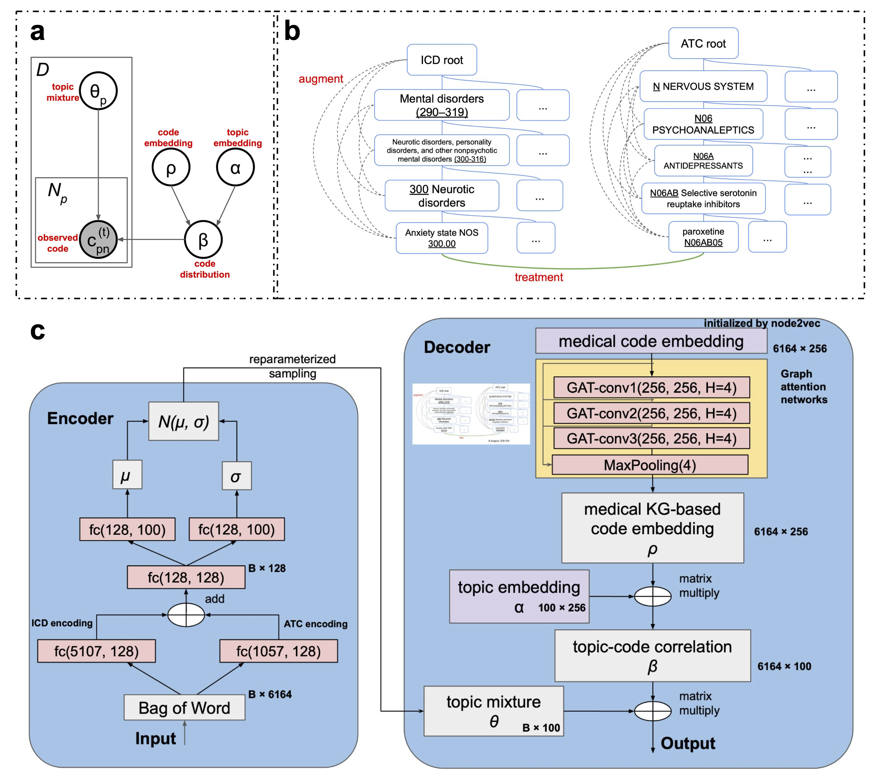

# GAT-ETM
**Graph ATtention-Embedded Topic Model (GAT-ETM)** is an end-to-end graph-based embedded topic model that jointly learns a knowledge graph of medical codes (ICD disease and ATC drug codes) and patients EHRs. Our model is able to learn multimodal (disease and drug) topics based on co-occurence patterns from EHR and semantic similarity from knowledge graph. Our idea is to leverage existing knowledge to aid EHR modeling especially for rare medical codes. Notice that this framework is general and the ICD-ATC knowledge graph can be replaced by other knowledge graphs of the medical codes utilized in EHR data. This repo is the code used in a journal paper "**Modeling electronic health record data using an end-to-end knowledge-graph-informed topic model**". Please refer to the paper  (https://www.nature.com/articles/s41598-022-22956-w) for details. 
<h2 align="center">
  Overview of GAT-ETM
  
</h2>

## Preparing Data:
**EHR data**

**Pre-trained code embeddings**

## Training

## Loading Trained Model and Evalutating

## Citation: 
Please cite the following paper if you use this source in your work.
```bibtex
@article{zou2022modeling,
  title={Modeling electronic health record data using an end-to-end knowledge-graph-informed topic model},
  author={Zou, Yuesong and Pesaranghader, Ahmad and Song, Ziyang and Verma, Aman and Buckeridge, David L and Li, Yue},
  journal={Scientific Reports},
  volume={12},
  number={1},
  pages={17868},
  year={2022},
  publisher={Nature Publishing Group UK London}
}
```
For any clarification, comments, or suggestions please create an issue or contact [Dr. Yue Li](https://www.cs.mcgill.ca/~yueli/) and [Yuesong Zou](https://zouyuesong.github.io/).
